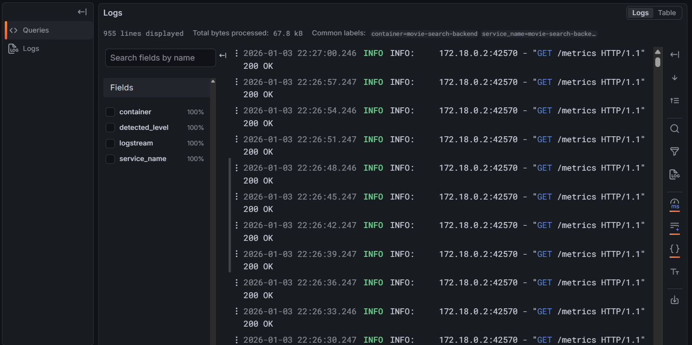

Кинотеатр для просмотра видео в режиме стриминга
---

- [О чем этот проект?](#зачем-это-нужно)
- [Кто разработал проект?](#кто-разработал)
- [Как запустить локально?](#запуск-проекта)
- [Как запустить локально?](#запуск-проекта)


## О чем этот проект? {#зачем-это-нужно}
Ключевые **возможности**  
- Поиск фильмов через **Elastic Search**
- Преобразование видео в **HLS** формат, сохранение в *S3* хранилище.
- Получение кусочков видео для обработки клиентом в браузере.
- Просмотр **логов**, а также **метрик** по просмотру видео.

## Кто разработал проект? {#кто-разработал}
Этот проект подготовлен студентами МАИ
- Овчинников Дмитрий
- Денис Устинов
- Савелий Самсонов

## Как запустить локально? {#запуск-проекта}
Проект разворачивается через **Docker**.  
Необходимы 2 простых действия
```bash
# 1) собрать бекенд в отдельный контейнер
# Docker desktop/docker должен быть запущен
docker build -t movie-search-backend .
```

```bash
# 2) Запустить все контейнеры для работы приложения
docker compose up -d
```





sudo chown -R 472:472 ./grafana_data
sudo chmod -R u+w ./grafana_data

sudo chown -R 65534:65534 ./prometheus_data


Доп