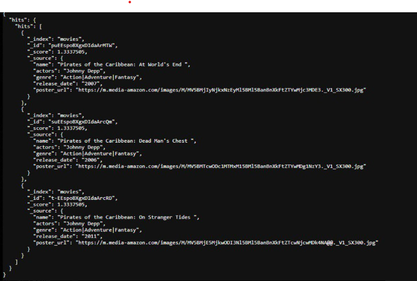
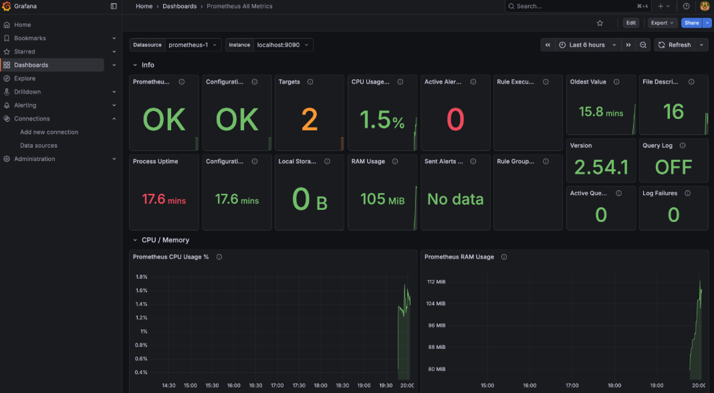

Кинотеатр для просмотра видео в режиме стриминга
---

- [О чем этот проект?](#о-чем-этот-проект)
- [Кто разработал проект?](#кто-разработал-проект)
- [Архитектура проекта?](#архитектура-проекта)
- [Как запустить локально?](#как-запустить-локально)
    - [Как добавить дашборды в графану?](#как-добавить-дашборды-в-графану)
- [Демонстрация работы](#демонстрация-работы)

## О чем этот проект? {#зачем-это-нужно}
Ключевые **возможности**  
- Поиск фильмов через **Elastic Search**
- Преобразование видео в **HLS** формат, сохранение в *S3* хранилище.
- Получение кусочков видео для обработки клиентом в браузере.
- Просмотр **логов**, а также **метрик** по просмотру видео.

## Кто разработал проект?
Этот проект подготовлен студентами МАИ
- Овчинников Дмитрий
- Денис Устинов
- Савелий Самсонов

## Архитектура проекта
 
## Как запустить локально? 
Проект разворачивается через **Docker**.  
Необходимы 3 простых действия

```bash
# 1) собрать бекенд в отдельный контейнер
# Docker desktop/docker должен быть запущен
docker build -t movie-search-backend .
```
```bash
# 2) Папки могут не иметь доступ, добавить для контейнеров.
sudo chown -R 472:472 ./grafana_data
sudo chmod -R u+w ./grafana_data

sudo chown -R 65534:65534 ./prometheus_data
```

```bash
# 3) Запустить все контейнеры для работы приложения
docker compose up -d
```

## Как добавить дашборды в графану? 
Дашборды храняся в папке 
[dashboards_for_grafana](dashboards_for_grafana)

# Демонстрация работы
> Api search
  
> Желательно добавить еще пример  

> Prometheus
  

> Loki

