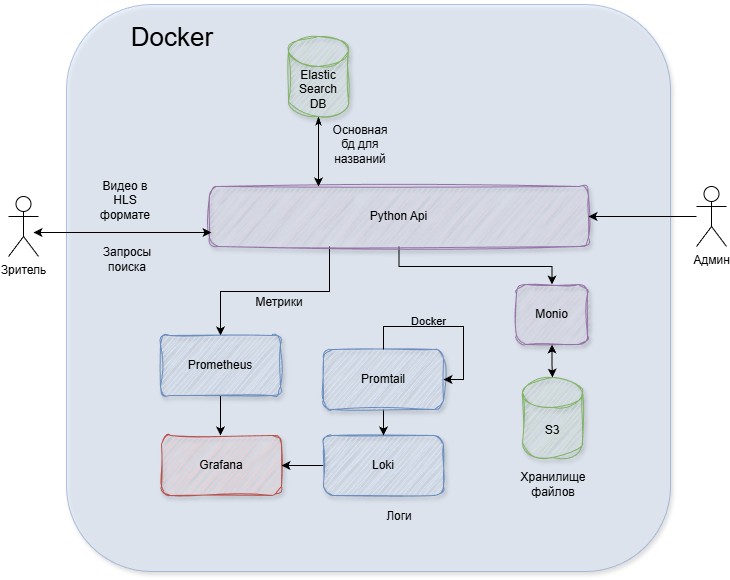
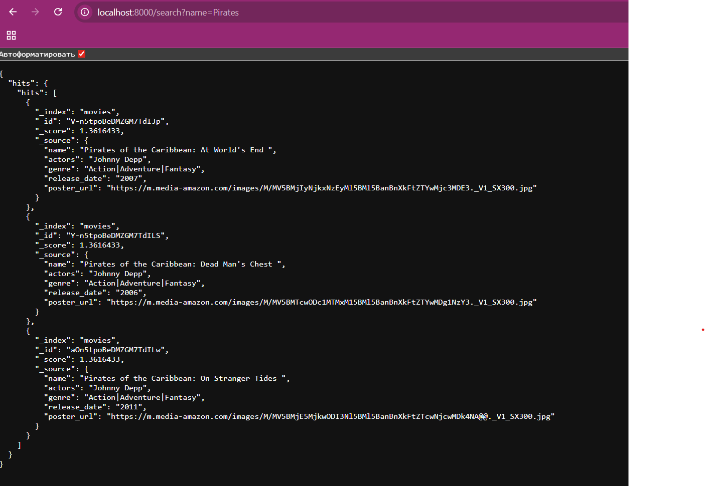
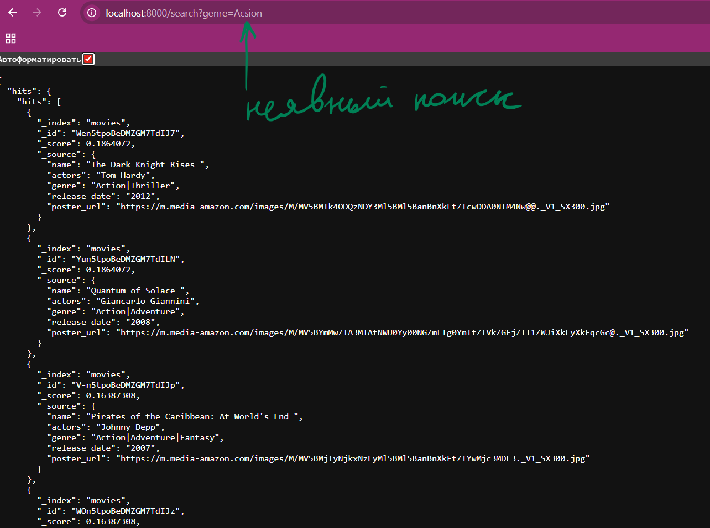
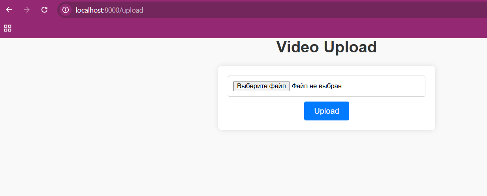
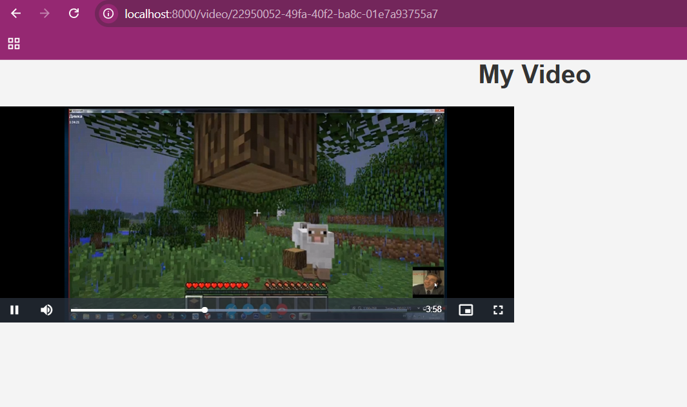
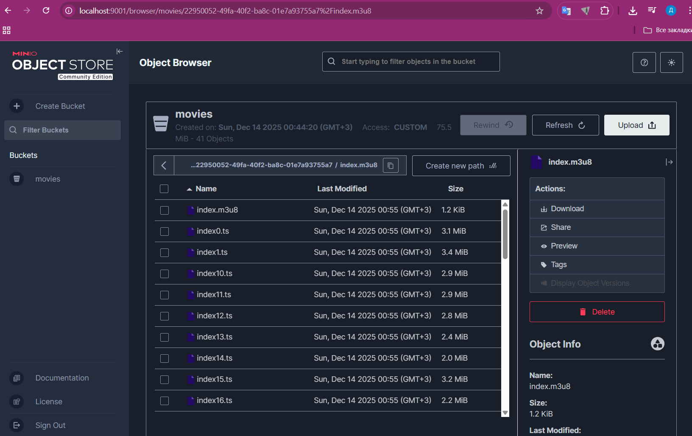
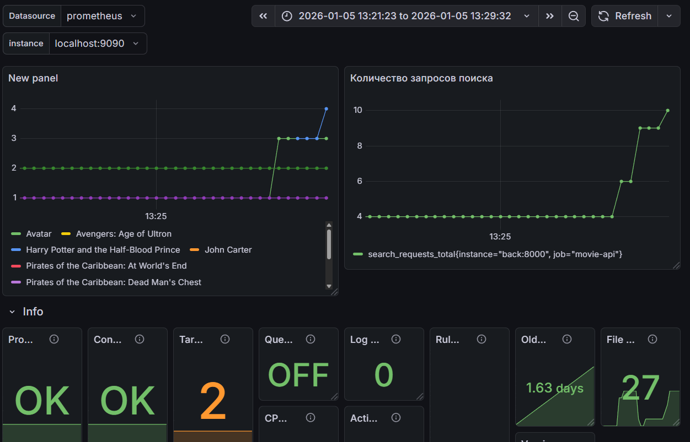
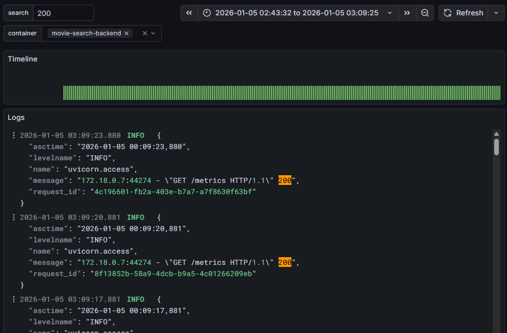

Кинотеатр для просмотра видео в режиме стриминга
---

- [О чем этот проект?](#о-чем-этот-проект)
- [Кто разработал проект?](#кто-разработал-проект)
- [Архитектура проекта?](#архитектура-проекта)
- [Как запустить локально?](#как-запустить-локально)
    - [Как добавить дашборды в графану?](#как-добавить-дашборды-в-графану)
- [Демонстрация работы](#демонстрация-работы)

## О чем этот проект?
Ключевые **возможности**  
- Поиск фильмов через **Elastic Search**
- Загрузка видео файлов в **S3** с преобразованием в **HLS** формат.
- Просмотр видео в **HLS** формате в браузере.
- Просмотр **логов**, а также **метрик** по просмотру видео.

## Кто разработал проект?
Этот проект подготовлен студентами МАИ
- Овчинников Дмитрий (DmitriMAI)
- Денис Устинов (lantum1)
- Савелий Самсонов (FlyingOwl8)

## Архитектура проекта
 
## Как запустить локально? 
Проект разворачивается через **Docker**.  
Необходимы 3 простых действия

```bash
# 1) собрать бекенд в отдельный контейнер
# Docker desktop/docker должен быть запущен
docker build -t movie-search-backend .
```

```bash
# 2) Запустить все контейнеры для работы приложения
docker compose up -d
```

## Как добавить дашборды в графану? 
Дашборды храняся в папке 
[dashboards_for_grafana](dashboards_for_grafana)

# Демонстрация работы
> Video
https://github.com/user-attachments/assets/d29c9c5a-cfc9-445b-a2b5-504b43db299b 

> Api search
  

> Неявный поиск 
  

> Upload страница
  

> Просмотр видео
  

> Minio


> Prometheus
  

> Loki

